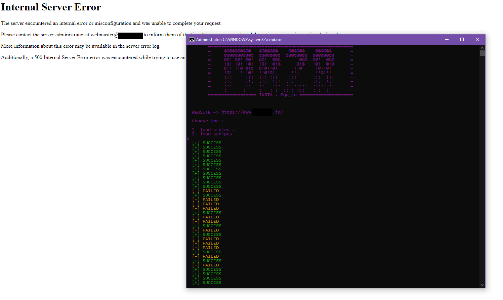
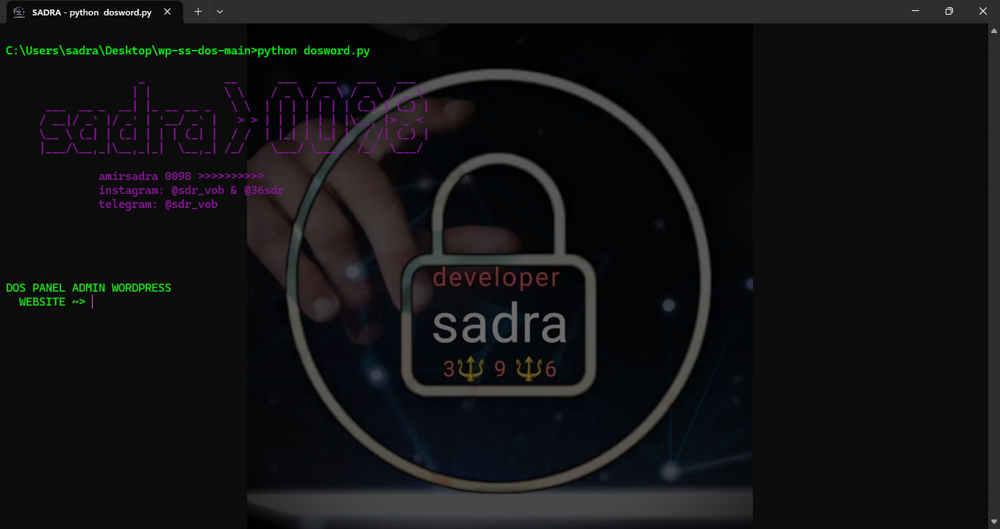

# SADRA - WP-DoS Tool

###                    _            __      ___   ___   ___   ___  
###                   | |           \ \    / _ \ / _ \ / _ \ / _ \ 
###      ___  __ _  __| |_ __ __ _   \ \  | | | | | | | (_) | (_) |
###     / __|/ _` |/ _` | '__/ _` |   > > | | | | | | |\__, |> _ < 
###     \__ \ (_| | (_| | | | (_| |  / /  | |_| | |_| |  / /| (_) |
###     |___/\__,_|\__,_|_|  \__,_| /_/    \___/ \___/  /_/  \___/ 
###                                                        
###              amirsadra 0098 >>>>>>>>>>
###              instagram: @sdr_vob & @36sdr
###              telegram: @sdr_vob
###
###                       "  />

Programmed By : Python

#### Notice 🛑⚠ ::  This Tool Work Only on WordPress Websites ( & may work just in some WP versions 😅 )

## Used libraries :
- requests
- threading
- time
- colorama
## SCREEN SHOT

## instagram : @36sdr 
## telegram : @sdr_vob
## twit : @6amirsadra6